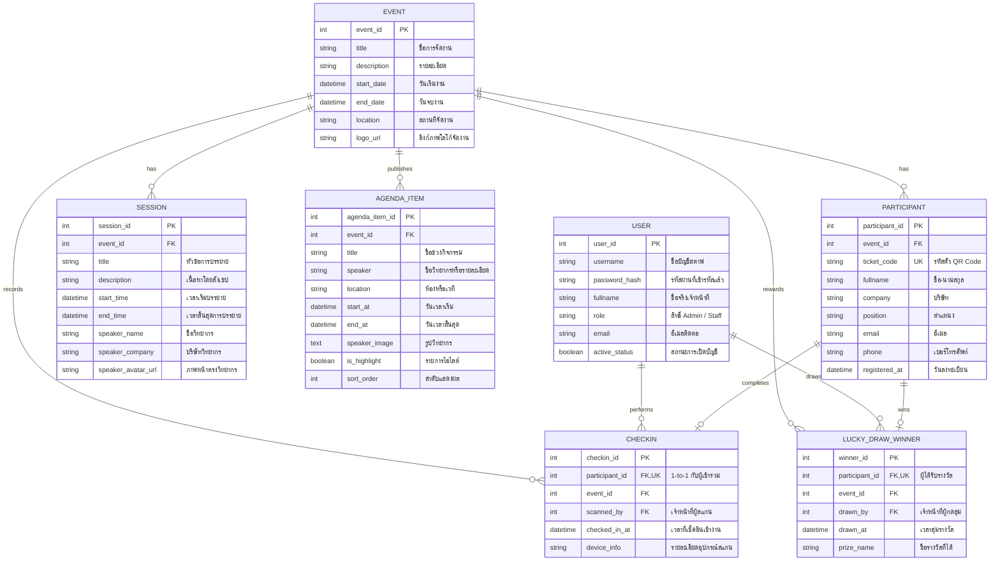

# เอกสารการออกแบบระบบและโครงสร้างฐานข้อมูล (System Design & ER Diagram)
## โครงการ: Smart Event Registration
### บทบาทผู้จัดทำ: Project Manager (PM)
### สำหรับ: Systems Analyst (SA) และทีมพัฒนา (Frontend/Backend)

---

## 1. บทบาทผู้ใช้งานและสิทธิ์เข้าถึง (User Roles & Permissions)

ระบบแบ่งออกเป็น 3 บทบาทหลัก เพื่อความปลอดภัยและการบริหารงานที่คล่องตัว:

| เมนูการใช้งานระบบ (Menus/Pages) | ผู้จัดงานหลัก (Super Admin) | เจ้าหน้าที่หน้างาน (Staff / Checker) | ผู้เข้าร่วมงาน (Participant / Guest) |
| :--- | :---: | :---: | :---: |
| **1. หน้าลงทะเบียนออนไลน์ (Register Form)** | ✓ | ✓ | ✓ (สิทธิ์กรอกข้อมูล) |
| **2. หน้าตั๋วและคิวอาร์โค้ด (My Event Pass)** | ✓ | ✓ | ✓ (สิทธิ์เปิดแสดงผล) |
| **3. หน้าเว็บประเมินผล/กิจกรรม (Engagement Portal)** | ✓ | ✓ | ✓ (สิทธิ์ทำกิจกรรม) |
| **4. แดชบอร์ดสถิติภาพรวม (Real-time Dashboard)** | ✓ | 𐄂 | 𐄂 |
| **5. ระบบจัดการรายชื่อผู้ร่วมงาน (Participant List CMS)** | ✓ (จัดการได้ทั้งหมด) | ✓ (สิทธิ์ค้นหา/ดูเท่านั้น) | 𐄂 |
| **6. หน้าต่างสแกนเช็คอิน (Scan Gate Terminal)** | ✓ | ✓ (สิทธิ์สแกนเช็คอิน) | 𐄂 |
| **7. ควบคุมจอภาพส่วนกลาง (Signage CMS Control)** | ✓ | 𐄂 | 𐄂 |
| **8. คอนโซลรันระบบจับรางวัล (Lucky Draw Engine)** | ✓ | 𐄂 | 𐄂 |
| **9. ตั้งค่าโครงการและผู้ใช้งาน (System Settings)** | ✓ | 𐄂 | 𐄂 |

---

## 2. รายละเอียดเมนูและโครงสร้างหน้าเว็บ (Menu & Page Details)

### 2.1 ส่วนงานฝั่งผู้เข้าร่วม (Participant Client Pages)
1.  **Online Registration Page (หน้าลงทะเบียน)**
    *   **วัตถุประสงค์**: สำหรับกรอกข้อมูลสมัครเข้าร่วมงานก่อนงานเริ่มหรือแบบ Walk-in
    *   **องค์ประกอบ**: ฟอร์มกรอกชื่อ-สกุล, บริษัท, ตำแหน่งงาน, อีเมล, เบอร์โทรศัพท์ และปุ่มกดยืนยัน
2.  **Digital Ticket Page (หน้าตั๋วเข้างาน)**
    *   **วัตถุประสงค์**: แสดงตั๋วดิจิทัลหลังจากลงทะเบียนสำเร็จเพื่อเตรียมสแกนหน้างาน
    *   **องค์ประกอบ**: ชื่อผู้เข้างาน, QR Code เฉพาะบุคคล (เข้ารหัสข้อมูลผู้สมัคร), ข้อมูลตารางกิจกรรมอย่างย่อ
3.  **Engagement Portal (หน้ากิจกรรม)**
    *   **วัตถุประสงค์**: เพิ่มปฏิสัมพันธ์ให้ผู้เข้าร่วมงานขณะอยู่ในงาน
    *   **องค์ประกอบ**: แบบสอบถามความพึงพอใจการจัดงาน (CSAT Score), ลิงก์เข้าร่วมจับรางวัล Lucky Draw

### 2.2 ส่วนงานฝั่งผู้จัดงานและเจ้าหน้าที่ (Back-Office & Operator Panels)
1.  **Analytics Dashboard Menu (เมนูแดชบอร์ด)**
    *   **วัตถุประสงค์**: มอนิเตอร์สถิติตัวเลขในงานแบบ Real-time
    *   **องค์ประกอบ**: ยอดสถิติ (Registered, Checked-in, Pending), กราฟเส้นแนวโน้มการสแกนในแต่ละชั่วโมง (Hourly Traffic), กราฟวงกลมอัตราการ Show-up
2.  **Participant Directory (เมนูจัดการผู้ร่วมงาน)**
    *   **วัตถุประสงค์**: ดูแล ควบคุม และจัดการรายชื่อผู้สมัครทั้งหมด
    *   **องค์ประกอบ**: แถบค้นหา (Search Box), ป้ายฟิลเตอร์แยกสถานะ, ตารางแสดงรายชื่อผู้สมัครพร้อมปุ่มแก้ไขข้อมูล (Edit), ลบชื่อ (Delete), และปุ่ม Import Excel/Export CSV
3.  **Scan Gate Terminal (หน้าเช็คอินสตาฟ)**
    *   **วัตถุประสงค์**: หน้าจอเชื่อมต่อกับเครื่องสแกนบาร์โค้ดหน้าประตูเพื่อสแกน QR Code ตรวจรับเข้างานแบบรวดเร็ว
    *   **องค์ประกอบ**: ช่องรับค่า Input จาก Scanner, เสียงสัญญาณ Beep ยืนยันการผ่านประตู, กล่องป็อปอัปแสดงภาพถ่ายและชื่อคนเช็คอินสำเร็จ
4.  **Signage Screens Controller (เมนูควบคุมจอใหญ่)**
    *   **วัตถุประสงค์**: สลับหน้าจอแสดงผลที่จะโชว์บน Video Wall ภายในงาน
    *   **องค์ประกอบ**: ปุ่มเลือกเทมเพลต 8 รูปแบบ (Welcome, Agenda, Overview, Next Speaker, Sponsors ฯลฯ)
5.  **Lucky Draw Control Panel (ระบบสุ่มรางวัล)**
    *   **วัตถุประสงค์**: คอนโซลสำหรับสุ่มจับสลากชื่อผู้โชคดีขึ้นจอใหญ่
    *   **องค์ประกอบ**: ปุ่มกดเริ่มรันระบบสุ่ม (SPIN), ฟิลเตอร์คัดเลือกเฉพาะคนเช็คอินจริง, แอนิเมชันสุ่มตัวอักษร, ประวัติรายชื่อผู้ได้รับรางวัล

---

## 3. แบบจำลองความสัมพันธ์ข้อมูล (Entity-Relationship Diagram - ERD)

แผนภาพ ER Diagram ต่อไปนี้ออกแบบมาเพื่อระบบเช็คอินแบบเรียลไทม์ โดยรองรับการบันทึกการเช็คอิน คิวตารางสัมมนา และระบบจับรางวัล:

---

## 4. รายละเอียดพจนานุกรมข้อมูล (Database Schema Dictionary)

### 4.1 ตาราง `PARTICIPANT` (ตารางข้อมูลผู้เข้าร่วมงาน)
*   ตารางหลักเก็บผู้ลงทะเบียน สามารถลงทะเบียนได้ล่วงหน้าก่อนวันจัดงานจริง
*   `ticket_code` คือรหัสสากล (UUID/String) ที่ใช้แปลงเป็นกราฟฟิก QR Code ส่งเข้าอีเมลผู้ร่วมงานเพื่อนำมาสแกนหน้างาน

### 4.2 ตาราง `CHECKIN` (ตารางบันทึกสถานะการสแกน)
*   มีความสัมพันธ์แบบ **1-to-1** กับตาราง `PARTICIPANT` (ผู้เข้าร่วมงาน 1 คน เช็คอินได้สูงสุด 1 ครั้ง เพื่อป้องกันการสแกนซ้ำซ้อน)
*   บันทึก `scanned_by` (FK เชื่อมโยงไปยังสตาฟผู้สแกน) เพื่อตรวจสอบประสิทธิภาพสตาฟแต่ละช่องทาง (Auditing)

### 4.3 ตาราง `LUCKY_DRAW_WINNER` (ตารางเก็บรายชื่อผู้โชคดี)
*   มีความสัมพันธ์แบบ **1-to-1** กับ `PARTICIPANT` (ผู้โชคดี 1 คนมีสิทธิ์รับได้ 1 รางวัล)
*   ระบบสุ่มจะคัดกรองเฉพาะผู้ที่มีตัวตนอยู่ในตาราง `CHECKIN` ในช่วงเวลานั้นๆ เท่านั้น (เพื่อการันตีว่าผู้โชคดีอยู่ในงานจริง)

หน้า Signage โหมด **Live Overview** ใช้ข้อมูลสถิติและรายการเช็คอินล่าสุดจาก WebSocket เพื่อแสดงตัวเลขหลัก, Show-up Rate และสถานะการเชื่อมต่อแบบเรียลไทม์ โดยไม่เรียก API เพิ่มระหว่างการอัปเดตหน้าจอ

### 4.4 ตาราง `AGENDA_ITEM` (กำหนดการสำหรับจอ LED)
*   เจ้าหน้าที่จัดการผ่านแท็บ **จัดการกำหนดการ** ในหน้า Settings และสามารถนำเข้า/ส่งออก Excel ที่ระบุวันที่ เวลา และรายละเอียดย่อได้ พร้อมค้นหา/กรองข้อมูลและแบ่งหน้าตามจำนวนรายการที่เลือก
*   ผลการบันทึกและข้อผิดพลาดแสดงด้วย SweetAlert โดยชี้รายการและฟิลด์ที่ผิด พร้อมตัวอย่างการกรอกที่ถูกต้อง
*   หน้า Signage กรองรายการตามวันปัจจุบันในเขตเวลา Asia/Bangkok แล้วเปรียบเทียบ `start_at` และ `end_at` เพื่อเน้นรายการที่กำลังดำเนินอยู่
*   การบันทึกกำหนดการจะกระจาย WebSocket `agenda:update` เพื่อให้จอ LED อัปเดตโดยไม่ต้องโหลดหน้าใหม่
